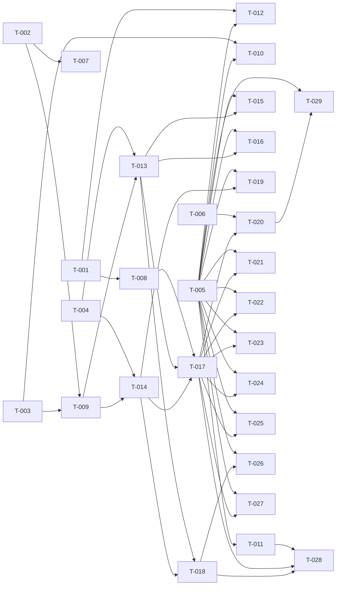

# Build Site

29 tasks across 6 tiers from 2 kits.

Kits: `cavekit-range-state.md` (RS, R1–R6, 34 criteria), `cavekit-parallel-execution.md` (PE, R1–R7, 38 criteria).

Test conventions used below:
- **Unit** = `go test ./...` with no database; always runs.
- **Integration** = tests in `internal/cli/global_blocks/*_integration_test.go` that use the T-005 harness. They need a real MySQL whose DSN is in `GB_MIGRATION_TEST_DSN`. When that variable is not set, the tests call `t.Skip`. Crash criteria are tested with fault injection: a test hook returns an error, or the test cancels the context, at a named point. When the context is cancelled, go-sql-driver closes the connection and MySQL rolls back the open transaction. That is the same outcome as the process being killed.

---

## Tier 0 — No Dependencies (Start Here)

| Task | Title | Cavekit | Requirement | Effort |
|------|-------|---------|-------------|--------|
| T-001 | `--workers`/`-w` option with validation before any DB access | parallel-execution | R1 | S |
| T-002 | Pure split computation and range type | range-state | R1, R3 | S |
| T-003 | State table upgrade: widen `set_key`, idempotent | range-state | R6 | S |
| T-004 | Range-scoped eligibility queries in repository | range-state | R1, R5 | S |
| T-005 | MySQL integration test harness (env-gated DSN, fixtures, fault hooks) | range-state, parallel-execution | (test infra for all DB criteria) | M |
| T-006 | Aggregate progress reporter (pure, injectable writer/clock) | parallel-execution | R5 | S |

## Tier 1 — Depends on Tier 0

| Task | Title | Cavekit | Requirement | blockedBy | Effort |
|------|-------|---------|-------------|-----------|--------|
| T-007 | Unit tests for split computation and range membership | range-state | R1, R3 | T-002 | S |
| T-008 | Connection pool sized to at least K+1 | parallel-execution | R2 | T-001 | S |
| T-009 | Split and per-range watermark persistence in state | range-state | R2, R4 | T-002, T-003 | M |
| T-010 | Integration tests: state storage upgrade | range-state | R6 | T-003, T-005 | S |
| T-011 | Capture golden baseline from pre-change sequential tool | parallel-execution | R6, R7 | T-005 | M |
| T-012 | Integration test: rejected worker count writes nothing | parallel-execution | R1 | T-001, T-005 | S |

## Tier 2 — Depends on Tier 1

| Task | Title | Cavekit | Requirement | blockedBy | Effort |
|------|-------|---------|-------------|-----------|--------|
| T-013 | Split bootstrap (`ensureSplit`) in `migrationRun` | range-state | R1, R2, R5 | T-004, T-009 | M |
| T-014 | Range worker loop + `migrateBatch` refactor with per-range watermark commit | range-state, parallel-execution | RS R4; PE R3 | T-004, T-009 | M |

## Tier 3 — Depends on Tier 2

| Task | Title | Cavekit | Requirement | blockedBy | Effort |
|------|-------|---------|-------------|-----------|--------|
| T-015 | Integration tests: split creation and persistence (incl. termination during creation) | range-state | R1, R2 | T-005, T-013 | M |
| T-016 | Integration tests: stored split reuse and K-mismatch notice | range-state | R5 | T-005, T-013 | S |
| T-017 | Concurrent orchestrator (one worker per range, fatal cancel, range-named error) | parallel-execution | R3, R4 | T-008, T-013, T-014 | M |
| T-018 | `--failed` path isolated from split/workers | parallel-execution | R7 | T-013, T-014 | S |
| T-019 | Integration tests: single range worker behaviour and watermarks | range-state, parallel-execution | RS R4; PE R3 | T-005, T-014 | M |

## Tier 4 — Depends on Tier 3

| Task | Title | Cavekit | Requirement | blockedBy | Effort |
|------|-------|---------|-------------|-----------|--------|
| T-020 | Wire aggregate progress into orchestrator (total = remaining across ranges) | parallel-execution | R5 | T-006, T-017 | S |
| T-021 | Fault-injection tests: crash at any point keeps watermark invariants | range-state, parallel-execution | RS R4; PE R4 | T-005, T-017 | M |
| T-022 | Integration tests: open-ended last range picks up new blocks | range-state | R3 | T-005, T-017 | S |
| T-023 | Integration tests: concurrency and non-blocking connection capacity | parallel-execution | R2, R3 | T-005, T-017 | M |
| T-024 | Integration tests: fatal error propagation and reporting | parallel-execution | R4 | T-005, T-017 | M |
| T-025 | Integration tests: exactly-once correctness for K in {1,2,4,8} and K=1 vs K=4 | parallel-execution | R6 | T-005, T-017 | M |
| T-026 | Integration tests: `--failed` ignores workers and split state | parallel-execution | R7 | T-005, T-018 | S |
| T-027 | Integration tests: resume after interruption | range-state, parallel-execution | RS R5; PE R4 | T-005, T-017 | M |
| T-028 | Golden equivalence: K=1 and `--failed` vs pre-change tool | parallel-execution | R6, R7 | T-011, T-017, T-018 | M |

## Tier 5 — Depends on Tier 4

| Task | Title | Cavekit | Requirement | blockedBy | Effort |
|------|-------|---------|-------------|-----------|--------|
| T-029 | Integration tests: aggregate progress output and totals | parallel-execution | R5 | T-005, T-020 | S |

---

## Task Details

**T-001: `--workers`/`-w` option**
- Add `workers int` in `internal/cli/global_blocks/migration.go`. Add `Flags().IntVarP(&workers, "workers", "w", 4, ...)` and `viper.BindPFlag("workers", ...)` in `command.go`. `viper.AutomaticEnv()` already there makes `WORKERS` the env var, the same convention as `DATABASE_URL`/`BATCH`.
- Validate `viper.GetInt("workers") >= 1` in `PreRunE`, before `database.NewDB` is called. On failure return an error such as `invalid worker count N: must be >= 1`. `cmd/root.go` then calls `os.Exit(1)`.
- Validates PE R1 c1–c6. It also provides the "no DB write" mechanism for R1 c7, which T-012 proves.
- Verify with unit tests in `command_test.go`. Run a fresh `NewCommand` with args `--workers 3`, `-w 3`, env `WORKERS=3` via `t.Setenv`, no flag (expect 4), `0`, and `-1`. Call `viper.Reset()` between cases. Assert the resolved value, or that `PreRunE` returns an error. Stub `RunE` so no DB is touched.

**T-002: Pure split computation**
- New file `internal/cli/global_blocks/split.go`:
  - `type idRange struct{ Index int; Lower int64; Upper *int64 }`, where `Upper == nil` means open-ended.
  - `computeSplit(ids []int64, k int) []idRange`. Input is ascending eligible IDs. It returns `min(k, N)` ranges. Chunk sizes are `N/K` or `N/K+1` (the first `N%K` ranges get the extra one). `Lower` is the first ID of the chunk. `Upper` is the last ID of the chunk, except the last range, which gets nil. N=0 returns nil.
  - `(r idRange) contains(id int64) bool`.
- Criteria: RS R1 c1–c6 (logic) and RS R3 c1 and c4 (last range unbounded, others bounded by stored upper). T-007 tests it.

**T-003: State table upgrade**
- In `state.go`: create `global_block_migration_state` with `set_key VARCHAR(64)`. Add `upgrade(ctx, db)`. It reads `CHARACTER_MAXIMUM_LENGTH` from `information_schema.COLUMNS` and runs `ALTER TABLE ... MODIFY set_key VARCHAR(64) NOT NULL` only if the length is below 64. Rows are preserved, and a second run does nothing.
- Define key constants: `split_k`, `range_%d_lower`, `range_%d_upper`, `range_%d_watermark`. Add a unit test that every key produced for K up to 9999 is at most 64 characters.
- Call `upgrade` from `state.init`.
- Criteria: RS R6 c1–c5 (mechanism). T-010 tests it against a real DB.

**T-004: Range-scoped eligibility queries**
- In `repository.go`, add three methods. All reuse the existing eligibility predicate (`metafield__int` api_version=2 STRAIGHT_JOIN `data`, `node_id` = global block):
  - `getAllEligibleIds(ctx)`: ordered, used for the split.
  - `getGlobalBlocksIdsInRange(ctx, after int64, upper *int64, batch int)`: `d.id > ? AND (upper IS NULL OR d.id <= ?)`, `ORDER BY d.id`, `LIMIT batch`.
  - `getRemainingCountInRange(ctx, after int64, upper *int64)`.
- Also fix the existing `rows.Close` placement.
- Criteria: RS R1 c9 (ineligible rows excluded by the reused predicate) and RS R5 c5 (remaining = `(watermark, upper]`).
- Verified by `go build`. Behaviour is covered by T-015 and T-027.

**T-005: Integration test harness**
- New `internal/testutil/mysqltest` package, or `harness_test.go` in the package. It includes:
  - `requireDB(t)`, which skips when `GB_MIGRATION_TEST_DSN` is unset and creates a throwaway schema per test.
  - Schema DDL for the legacy tables (`node`, `metafield`, `metafield__int`, `data`, …) and the target tables.
  - Seed builders: eligible blocks, ineligible blocks (wrong node and api_version≠2), and blocks that are known to fail, for example malformed rules JSON.
  - Snapshot helpers for migrated data, the failed table, and state rows.
  - A stdout capture helper.
- Adds package-level test hook variables, nil in production: `testHookBeforeBatchCommit(rangeIdx)`, `testHookBatchStart(rangeIdx)`, `testHookSplitStoreStep(i)`. Later tasks call these hooks.
- **Needs a human-provided schema dump** (DDL for the legacy and new tables) and a representative seed. The target schema is not in the repo.
- Criteria: infrastructure for all DB-dependent criteria. Verify that `go test ./...` passes with the DSN unset (the tests skip) and with it set.

**T-006: Aggregate progress reporter**
- New `progress.go` with `type progress struct{ total int64; processed atomic.Int64; start time.Time; w io.Writer; now func() time.Time }`.
- `add(n)` is called by workers. `render()` writes one line, `\033[F\033[2KProgress: %.2f%% (%d/%d) | %.2f blocks/s`, where throughput = processed ÷ time since start.
- A single goroutine drives `render()` on a ticker and once at the end. Workers never print.
- Criteria: PE R5 c1–c4.
- Unit test with a fake clock and a buffer. Assert the format, the percentage, and the rate. Assert that concurrent `add` calls from N goroutines produce only a single line; each render rewrites the same line.

**T-007: Split unit tests**
- `split_test.go`, table-driven. Cases:
  - N=10, K=3: 3 ranges with sizes 4, 3, 3.
  - N=K; N<K (N=3, K=8 gives 3 single-ID ranges); N=0 gives nil.
  - Sparse and gapped IDs.
- Asserts:
  - count = K.
  - Every ID appears in exactly one range (via `contains`).
  - No overlap.
  - Sorted lowers are each greater than the previous upper, with no input ID between ranges.
  - Every size is within ±1 of N/K.
  - Only the last range has `Upper == nil`.
  - For non-last ranges, `contains(upper+1)` is false.
  - Last range `contains(maxID+1000)`.
- Criteria: RS R1 c1–c6 and RS R3 c1, c4.

**T-008: Connection pool capacity**
- Change `database.NewDB(dsn)` to `NewDB(dsn string, workers int)`. Extract `configurePool(db, workers)`, which sets `SetMaxOpenConns(max(workers+1, 20))` and matches idle to it. Update the caller in `migrationRun`.
- Criteria: PE R2 c1, and the mechanism for PE R2 c2.
- Unit test `mysql_test.go`: open `sql.OpenDB` on an unconnected connector (no ping), call `configurePool` with K in {1, 4, 50}, and assert `db.Stats().MaxOpenConnections >= K+1`. T-023 tests c2 with a DB.

**T-009: Split and watermark persistence**
- In `state.go`, add:
  - `loadSplit(ctx) (k int, ranges []storedRange, ok bool, err error)`, where `storedRange` = `idRange` + watermark.
  - `storeSplit(ctx, db, ranges)`. It writes `split_k` and each range's lower, upper (omitted for the last range), and watermark (initially lower−1) in **one transaction**. `testHookSplitStoreStep` is called between inserts.
  - `updateRangeWatermark(ctx, idx, id)`, a tx-bound statement copied in `state.withTx`.
- `loadSplit` returns an error if the number of ranges found does not equal `split_k`. The legacy `latest_processed_block_id` key is ignored.
- Criteria: RS R2 c2 and c3 (all-or-nothing via a single tx) and RS R4 c1 (independent per-range key).
- Verified by T-015 and T-019.

**T-010: Upgrade integration tests**
- Create the legacy `global_block_migration_state` with `VARCHAR(25)` and the row `latest_processed_block_id=123`.
- Run `state.init`, then write and read back every key the tool writes, including `range_9999_watermark`. Expect exact key equality.
- Check that the legacy row is unchanged. Run `init` again: no error, and a row snapshot equal to before.
- Criteria: RS R6 c1–c5.

**T-011: Golden baseline capture**
- Script `scripts/capture_baseline.sh` plus the test helper. It checks out commit `7c5eea1` (the pre-change sequential tool) in a `git worktree` and builds it.
- It runs it against the fixture DB from empty migration state. A second step seeds failed rows and runs `--failed`.
- It dumps the migrated tables and the `global_block_migration_failed` contents (excluding `failed_at`, with auto-increment IDs normalised) to `testdata/golden/*.json`.
- **Needs a human-provided fixture DB**: realistic global blocks, including some that fail migration.
- Criteria: the baseline half of PE R6 c5 and PE R7 c4. T-028 does the comparison.

**T-012: Rejected worker count writes nothing**
- Integration test. Snapshot the migrated tables, the failed table, and the state table. Execute the command with `-w 0` and `-w -2` against the harness DSN.
- Assert that an error is returned, the error message is non-empty, and all snapshots are unchanged.
- Criteria: PE R1 c7.

**T-013: Split bootstrap**
- In `migrationRun` (non-`--failed` branch), add `ensureSplit(ctx, requestedK)`:
  - `loadSplit`. If a split is found and stored K ≠ requested K, print `Notice: stored split has K=S, requested K=R; using stored split`.
  - If none is found: `getAllEligibleIds`. If empty, print `Nothing to migrate` and return without storing. Otherwise `computeSplit`, then `storeSplit`, before any worker is started.
  - Remove the old `getState`/`latest_processed_block_id` path.
- Criteria: RS R1 c7 and c8; RS R2 c1 and c4 (ordering); RS R5 c1–c4.
- Verified by T-015 and T-016.

**T-014: Range worker loop**
- Refactor `migrateBatch` to take a `commitProgress func(txSt *state) error` in place of `updateState`. The range path passes `updateRangeWatermark(idx, max(ids))`. The failed path passes nil. SAVEPOINT isolation is unchanged, and failed blocks are still added in the same tx.
- New `runRange(ctx, r storedRange, batch int, p *progress)`. It loops `getGlobalBlocksIdsInRange(watermark, r.Upper, batch)` → `getGlobalBLocks` → `migrateBatch`, advances the in-memory watermark, and returns as soon as a lookup comes back empty. There is no polling. It calls the `testHookBatchStart` and `testHookBeforeBatchCommit` hooks.
- Criteria: RS R4 c1–c3 and c6; PE R3 c2–c8.
- Verified by T-019.

**T-015: Split creation/persistence integration tests**
- Seed eligible IDs, plus ineligible rows (wrong node, api_version=1) interleaved.
- Run `ensureSplit` with K in {1, 3, 8}, and with N<K. Assert:
  - `split_k` = number of stored ranges = min(K, N).
  - The coverage, disjointness, and contiguity rules hold on the real eligible IDs.
  - Ineligible IDs do not change the counts.
- Zero eligible: output contains `Nothing to migrate` and there are no split rows.
- Termination during creation: for each step i, `testHookSplitStoreStep` cancels the context. Assert that the state contains either no split or a full split.
- Assert that no migrated data exists after `ensureSplit` and before workers.
- Criteria: RS R1 c1–c3 and c6–c9; RS R2 c1–c4.

**T-016: Stored split reuse tests**
- Store a split with S=4. Run `ensureSplit` with requested 4, then with requested 2 and 8.
- Assert that the range rows are byte-identical before and after.
- Capture stdout. The notice appears only when requested ≠ S.
- Criteria: RS R5 c1–c4.

**T-017: Concurrent orchestrator**
- `runRanges(ctx, ranges, batch, p)` uses `golang.org/x/sync/errgroup` (new go.mod dependency) `WithContext`. It starts one goroutine per range that has remaining work; a range with none returns immediately.
- A worker error (anything except per-block failures, which `migrateBatch` already absorbs) is wrapped as `range %d [%d, %s]: %w`, with the upper shown as `+inf` for the last range. The error cancels the group context, so the other workers stop before their next batch (check `ctx.Err()` at the top of each loop).
- `migrationRun` returns the error, and `root.go` exits with status 1.
- Criteria: PE R3 c1; PE R4 c1, c3, c4, and c6.
- Verified by T-023 and T-024.

**T-018: `--failed` isolation**
- In `migrationRun`, branch on `failed` **before** `ensureSplit` and before any `loadSplit`. Keep the existing sequential `iterateThroughBatches(failedOnly=true)` path unchanged, apart from the `migrateBatch` signature: it removes failed IDs and re-adds the ones that still fail.
- `--workers` is ignored. There is always a single goroutine and no state-key reads or writes.
- Criteria: PE R7 c1–c3.
- Verified by T-026 and T-028.

**T-019: Single range worker integration tests**
- Store a split, then run `runRange` for one range with `batch=3`. Use a hook to record each batch's IDs. Assert:
  - IDs are ascending and within the range.
  - Batch size is at most 3.
  - After each commit, the watermark equals the batch maximum and the other ranges' watermarks are unchanged.
  - A seeded failing block has no migrated rows, has a failed-table row with the error, and its batch peers are committed. The watermark passes it.
  - Each batch is its own tx: an error injected in batch 2's pre-commit leaves batch 1 committed.
  - A range with no remaining work migrates nothing.
  - The worker returns promptly after an empty lookup (no polling; bounded by a test timeout).
- Criteria: RS R4 c1–c3 and c6; PE R3 c2–c8.

**T-020: Progress wiring**
- In `migrationRun`, compute total = Σ `getRemainingCountInRange(watermark, upper)` over the stored ranges at run start. Construct `progress`, pass it to workers (`p.add(len(ids))` after each commit), and render the final line on completion.
- Remove the per-batch `Printf` and the `No entities to process` message from the worker paths.
- Criteria: PE R5 c5 and c6 (mechanism).
- Verified by T-029.

**T-021: Crash-safety fault-injection tests**
- Run full parallel migrations with K=4. Cancel the context, or return an error, at each hook point: `testHookBatchStart`, mid-batch after N savepoints, and `testHookBeforeBatchCommit`, each across several batch indices.
- After each abort, for every range:
  - every eligible ID at or below the watermark has migrated data or a failed row;
  - no eligible ID above the watermark has migrated data;
  - no batch is half-present.
- Optional extra: SIGKILL a subprocess build at a random delay, for realism.
- Criteria: RS R4 c4 and c5; PE R4 c2.

**T-022: Open-ended last range tests**
- During a run, a `testHookBatchStart` hook on the last range inserts an eligible block with ID > the split-time maximum. Assert that it is migrated in the same run, and that it is not migrated when inserted after the last worker finished.
- After a completed run, insert another such block and rerun with the stored split. Assert that it is migrated by the last range.
- Assert that no non-last range processed IDs above its upper bound.
- Criteria: RS R3 c1–c4.

**T-023: Concurrency and connection capacity tests**
- K=4 with 4 ranges that all have work. `testHookBeforeBatchCommit` waits on a K-party barrier with a 10s timeout, while each worker holds an open tx. All K must reach the barrier.
- Assert `db.Stats().WaitCount == 0` and a max concurrent in-flight counter equal to K.
- Also: a range with no work exits without batches, and all workers exit after empty lookups, with the test completing in bounded time.
- Criteria: PE R2 c2; PE R3 c1, c7, and c8.

**T-024: Fatal error tests**
- Inject a fatal error (hook returns an error) in range 2's second batch. Assert:
  - The other workers start no batch after the cancel. Compare `testHookBatchStart` timestamps with the cancel time.
  - The command's `RunE` returns non-nil. `root.go` maps that to exit status 1; a subprocess test checks the exit code.
  - The error string includes `range 2` and its lower and upper bounds. A last-range failure shows `+inf`.
- Separately, a seeded per-block failure causes no cancellation, and all ranges complete.
- Criteria: PE R4 c1, c3, c4, and c6.

**T-025: Correctness equivalence across K**
- For K in {1, 2, 4, 8}, on fresh copies of the same fixture with some failing blocks, run to completion. Assert:
  - every eligible ID has migrated data XOR a failed row;
  - there are no duplicate migrated records (group by source data ID, count = 1);
  - no ID is missing both.
- Compare the migrated-ID set and the failed-ID set between K=1 and K=4.
- Criteria: PE R6 c1–c4.

**T-026: `--failed` isolation tests**
- Store a split with watermarks and seed failed rows. Run `--failed -w 8`.
- Assert that the state-table snapshot is identical before and after (no split created, read, or modified). Assert, via a max concurrent in-flight counter, that one batch is in flight at most.
- Also run on a DB with no split: still no split rows afterwards.
- Criteria: PE R7 c1–c3.

**T-027: Resume after interruption tests**
- Run K=4 with a fatal error injected mid-run. Record the watermarks.
- Assert that `getRemainingCountInRange` / `getGlobalBlocksIdsInRange` return exactly the eligible IDs in `(watermark, upper]` per range. Rerun without the fault.
- Assert that no ID at or below the pre-rerun watermark is migrated again (no duplicate rows, and those rows keep the same insert IDs), each range continued from its own watermark, and the final state is complete.
- Criteria: RS R5 c5 and c6; PE R4 c5.

**T-028: Golden equivalence vs pre-change tool**
- On the human-provided fixture, from empty migration state, run the new tool with `-w 1`. Normalise the migrated tables and the failed table, then compare them to the T-011 golden.
- Seed the same failed rows as T-011, run `--failed`, and compare to the failed-mode golden.
- Criteria: PE R6 c5 and PE R7 c4. **Requires the fixture from T-011.**

**T-029: Progress output integration tests**
- K=4 run with captured stdout. Assert:
  - Only one progress line exists. Every progress write is prefixed with cursor-up + clear-line, and there are no per-worker lines.
  - The line contains `processed/total`, `%`, and `blocks/s`.
  - total = the pre-computed sum of remaining work over ranges.
  - At the end, processed ≥ total.
  - With a block inserted into the last range during the run (the T-022 hook), processed = total + 1.
- Criteria: PE R5 c1–c6.

---

## Dependency Graph

---

## Summary

| Tier | Tasks | Effort |
|------|-------|--------|
| 0 | 6 (T-001–T-006) | 5S, 1M |
| 1 | 6 (T-007–T-012) | 4S, 2M |
| 2 | 2 (T-013–T-014) | 2M |
| 3 | 5 (T-015–T-019) | 2S, 3M |
| 4 | 9 (T-020–T-028) | 3S, 6M |
| 5 | 1 (T-029) | 1S |

**Total: 29 tasks, 6 tiers**

---

## Coverage Matrix

| Cavekit | Req | Criterion | Task(s) | Status |
|---------|-----|-----------|---------|--------|
| range-state | R1 | N>=K, no stored split: exactly K ranges | T-002, T-007, T-015 | COVERED |
| range-state | R1 | No eligible ID in more than one range | T-002, T-007, T-015 | COVERED |
| range-state | R1 | Every eligible ID at split time in exactly one range | T-002, T-007, T-015 | COVERED |
| range-state | R1 | Ranges contiguous in ID order, no eligible ID between ranges | T-002, T-007, T-015 | COVERED |
| range-state | R1 | N>=K: each range count within ±1 of N/K | T-002, T-007 | COVERED |
| range-state | R1 | 0<N<K: exactly N ranges, one block each | T-002, T-007, T-015 | COVERED |
| range-state | R1 | Zero eligible: no split stored | T-013, T-015 | COVERED |
| range-state | R1 | Zero eligible: output contains "Nothing to migrate" | T-013, T-015 | COVERED |
| range-state | R1 | Ineligible blocks do not affect range counts | T-004, T-015 | COVERED |
| range-state | R2 | Stored K + all bounds present before any block migrated | T-013, T-015 | COVERED |
| range-state | R2 | Stored K equals number of stored ranges | T-009, T-015 | COVERED |
| range-state | R2 | Termination during split creation: no split or complete split, never partial | T-009, T-015 | COVERED |
| range-state | R2 | No migrated data committed before complete split stored | T-013, T-015 | COVERED |
| range-state | R3 | Stored last range has no upper bound | T-002, T-007, T-022 | COVERED |
| range-state | R3 | New block > split max inserted during run goes to last range (this run if present at next lookup, else next run) | T-022 | COVERED |
| range-state | R3 | New block > split max inserted after completed run processed by last range next run | T-022 | COVERED |
| range-state | R3 | No non-last range contains IDs > its stored upper | T-002, T-007, T-022 | COVERED |
| range-state | R4 | Each range has its own independent watermark | T-009, T-019 | COVERED |
| range-state | R4 | After batch commit, range watermark = max ID in batch | T-014, T-019 | COVERED |
| range-state | R4 | After batch commit, other ranges' watermarks unchanged | T-014, T-019 | COVERED |
| range-state | R4 | Terminated anytime: all IDs <= watermark have migrated data or failed record | T-021 | COVERED |
| range-state | R4 | Terminated anytime: no ID > watermark has migrated data | T-021 | COVERED |
| range-state | R4 | Failed block recorded with error; watermark still advances past it | T-014, T-019 | COVERED |
| range-state | R5 | Stored K=S, requested S: range count and bounds unchanged | T-013, T-016 | COVERED |
| range-state | R5 | Stored K=S, requested !=S: range count and bounds unchanged | T-013, T-016 | COVERED |
| range-state | R5 | Requested !=S: notice that stored K differs | T-013, T-016 | COVERED |
| range-state | R5 | Requested =S: no notice | T-013, T-016 | COVERED |
| range-state | R5 | Resume: remaining = eligible IDs in (watermark, upper] (unbounded last) | T-004, T-027 | COVERED |
| range-state | R5 | Resume: no ID <= watermark migrated again | T-027 | COVERED |
| range-state | R6 | Every written key reads back exactly, no truncation | T-003, T-010 | COVERED |
| range-state | R6 | Legacy 25-char storage: after upgrade keys stored untruncated | T-003, T-010 | COVERED |
| range-state | R6 | Legacy storage with rows: rows preserved with unchanged keys/values | T-003, T-010 | COVERED |
| range-state | R6 | Second upgrade completes without error | T-003, T-010 | COVERED |
| range-state | R6 | Second upgrade leaves rows/values unchanged | T-003, T-010 | COVERED |
| parallel-execution | R1 | `--workers 3` sets 3 | T-001 | COVERED |
| parallel-execution | R1 | `-w 3` sets 3 | T-001 | COVERED |
| parallel-execution | R1 | Env var (same convention) sets worker count | T-001 | COVERED |
| parallel-execution | R1 | No flag/env: default 4 | T-001 | COVERED |
| parallel-execution | R1 | Worker count 0: non-zero exit + error message | T-001, T-012 | COVERED |
| parallel-execution | R1 | Negative worker count: non-zero exit + error message | T-001, T-012 | COVERED |
| parallel-execution | R1 | Rejected count: no DB write (state, migrated, failed unchanged) | T-001, T-012 | COVERED |
| parallel-execution | R2 | Max open connections >= K+1 | T-008 | COVERED |
| parallel-execution | R2 | All K workers hold tx simultaneously without blocking on acquisition | T-008, T-023 | COVERED |
| parallel-execution | R3 | R ranges with work: R workers run concurrently | T-017, T-023 | COVERED |
| parallel-execution | R3 | Worker only processes IDs in its range | T-014, T-019 | COVERED |
| parallel-execution | R3 | Batches in ascending ID order within range | T-014, T-019 | COVERED |
| parallel-execution | R3 | Each batch <= `--batch` blocks | T-014, T-019 | COVERED |
| parallel-execution | R3 | Each batch its own transaction | T-014, T-019 | COVERED |
| parallel-execution | R3 | Failing block: no migrated data, failed record w/ error, peers commit | T-014, T-019 | COVERED |
| parallel-execution | R3 | Range with no remaining work finishes without migrating | T-014, T-019, T-023 | COVERED |
| parallel-execution | R3 | Worker finishes on first empty lookup (incl. last range), no waiting/polling | T-014, T-019, T-023 | COVERED |
| parallel-execution | R4 | Fatal error in one worker: others stop starting new batches | T-017, T-024 | COVERED |
| parallel-execution | R4 | After fatal error no batch partially committed (data + watermark atomic) | T-021 | COVERED |
| parallel-execution | R4 | After fatal error: non-zero exit | T-017, T-024 | COVERED |
| parallel-execution | R4 | Error output names range index + lower/upper (open-ended last) | T-017, T-024 | COVERED |
| parallel-execution | R4 | Rerun after fatal error resumes each range from its watermark | T-027 | COVERED |
| parallel-execution | R4 | Single-block failure does not cancel any worker | T-017, T-024 | COVERED |
| parallel-execution | R5 | Exactly one progress line for all workers | T-006, T-029 | COVERED |
| parallel-execution | R5 | Shows processed and total | T-006, T-029 | COVERED |
| parallel-execution | R5 | Shows percentage | T-006, T-029 | COVERED |
| parallel-execution | R5 | Shows overall blocks/second | T-006, T-029 | COVERED |
| parallel-execution | R5 | Total = sum of remaining across ranges at start | T-020, T-029 | COVERED |
| parallel-execution | R5 | At completion processed >= total (exceeds only with in-run inserts) | T-020, T-029 | COVERED |
| parallel-execution | R6 | K in {1,2,4,8}: every eligible block migrated or failed | T-025 | COVERED |
| parallel-execution | R6 | Any K: no block migrated more than once | T-025 | COVERED |
| parallel-execution | R6 | Any K: no block missing both migrated data and failed record | T-025 | COVERED |
| parallel-execution | R6 | K=1 and K=4 migrated/failed sets identical | T-025 | COVERED |
| parallel-execution | R6 | K=1 from empty state equals existing sequential tool | T-011, T-028 | COVERED |
| parallel-execution | R7 | `--failed` uses single worker regardless of `--workers` | T-018, T-026 | COVERED |
| parallel-execution | R7 | `--failed` does not create a split | T-018, T-026 | COVERED |
| parallel-execution | R7 | `--failed` does not read/modify split or watermarks | T-018, T-026 | COVERED |
| parallel-execution | R7 | `--failed` output equals existing tool for same input | T-011, T-028 | COVERED |

**Coverage: 72/72 criteria (100%)**
